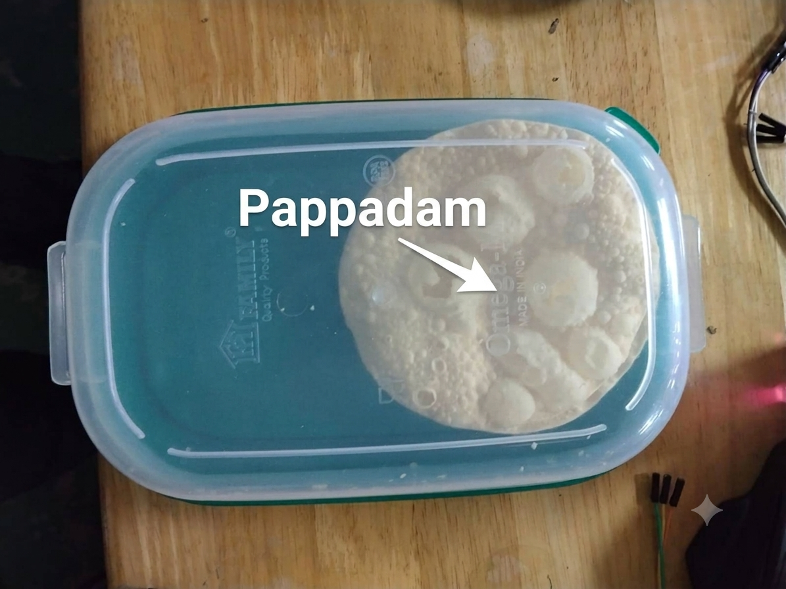
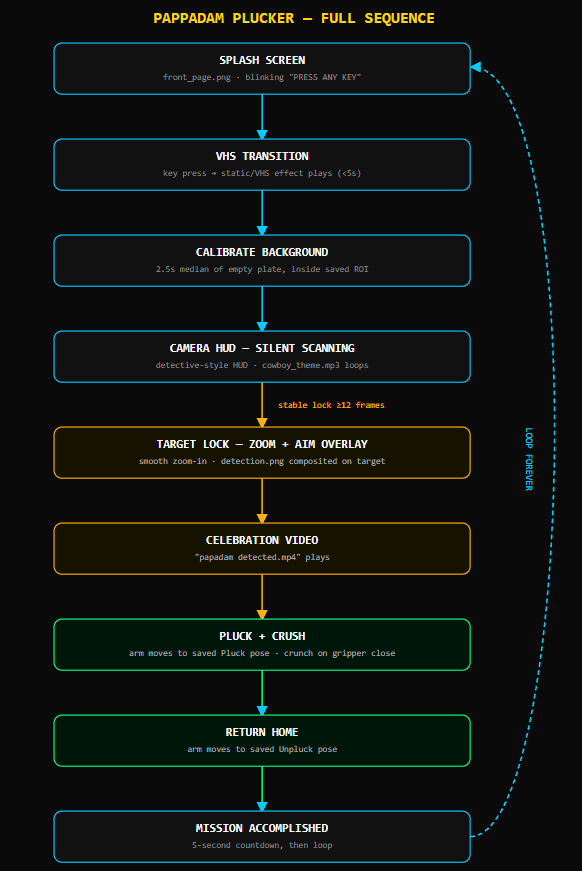
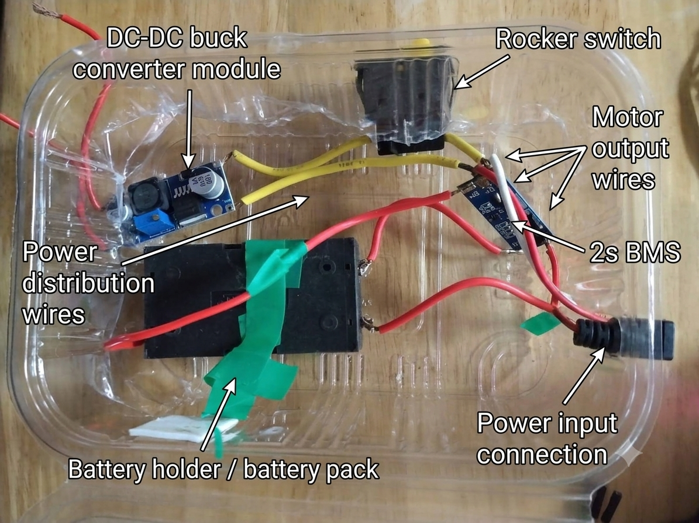
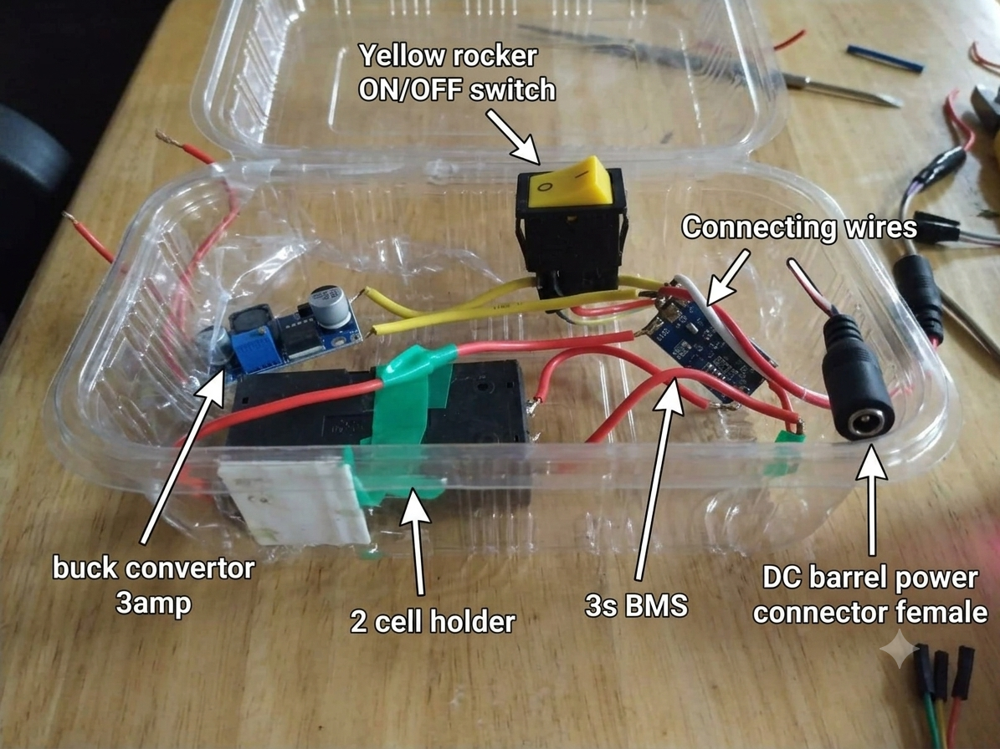

# Pappadam Plucker

.png)

> An unnecessarily advanced robotic system that detects a pappadam, locks onto it, and crushes it before it can peacefully join your rice and curry.

## Basic Details

### Team Name: KattadiTMT: Ith Kaatath Adilla

### Team Members
- Team Lead: Mekha Rachel — Saintgits College of Engineering
- Member 2: Christy Roy — Saintgits College of Engineering

### Project Description

We are KattadiTMT, presenting the **Autonomous Pappadam Plucker**: a 6-axis robotic arm that automates the deeply exhausting task of crushing pappadam before eating.

The system uses an Android phone as an overhead camera, OpenCV-based pappadam detection, a tactical crosshair interface, and a robotic arm with saved coordinates. Once the pappadam is locked onto, the arm moves to a pre-taught crushing position, plays a dramatic crunch sound, and returns safely home.

### The Problem (that doesn't exist)

While eating rice, we often have to crush pappadam before mixing it with rice and curry. This robotic arm helps crush pappadam before eating.

More importantly, it protects humanity from the unbearable inconvenience of using its own fingers.

### The Solution (that nobody asked for)

A 6-axis robot arm watches a plate through a phone camera like a highly overqualified surveillance system.

1. The phone streams a live view of the plate to Python through IP Webcam.
2. The software learns what the empty plate looks like during calibration.
3. When a pappadam appears, the system checks whether the new object is sufficiently round and pappadam-like.
4. A military-style interface announces `PAPPADAM DETECTED - TARGET LOCKED` and draws a crosshair at the pappadam’s centre.
5. The robotic arm moves smoothly to a pre-saved pluck position.
6. The gripper/crusher closes, a crunch sound plays, and the pappadam is eliminated.
7. The arm returns to its safe home position, ready for its next extremely important mission.

## Technical Details

### Technologies/Components Used

#### For Software
- Python 3 — main application language
- CustomTkinter — dark-glass robot control interface
- OpenCV (`opencv-python`) — phone-camera capture, calibration, background subtraction, object detection, and tactical crosshair rendering
- NumPy — image-processing calculations
- Pillow (`PIL`) — splash-image handling, CRT-style transition, and Tkinter image rendering
- Pygame — pappadam-crushing sound effect playback
- PySerial — USB serial communication from laptop to ESP32
- IP Webcam (Android app) — turns the phone into a Wi-Fi camera source
- VS Code — development environment
- GitHub — code, documentation, build log, and project story

#### For Hardware
- 6-axis robotic arm, reused and upgraded from an earlier project
- ESP32 microcontroller running the arm firmware
- Adafruit PCA9685 16-channel PWM servo driver
- MG995 servo motors for base rotation, shoulder, and wrist pitch
- SG90 servo motors for elbow, wrist roll, and gripper
- Robotic gripper/crusher mechanism
- ESP8266-based glove controller for optional ESP-NOW manual override
- Android phone running IP Webcam, mounted above the plate
- Custom power module using battery packs, BMS boards, buck converters, rocker switch, and DC barrel connector
- A plate and one unfortunate pappadam

## Implementation

### Installation

```powershell
# Create and activate a project environment
uv venv .venv --python 3.14
.\.venv\Scripts\Activate.ps1

# Install Python requirements
uv pip install opencv-python numpy customtkinter pyserial pillow pygame
```

### Run

1. Power the robot arm using its external servo power system.
2. Connect the ESP32 to the laptop using USB.
3. Connect the Android phone and laptop to the same Wi-Fi network or hotspot.
4. Open IP Webcam on the phone and start the video server.
5. Copy the phone camera URL ending in `/video`.
6. Update the camera URL in the Python file:

```python
PHONE_URL = "http://YOUR_PHONE_IP:8080/video"
```

7. Run the integrated application:

```powershell
python pappadam_plucker_integreated.py
```

8. Keep the plate empty during the 2.5-second background calibration.
9. In the control panel, select the correct COM port, click **Connect**, then **Enable System**.
10. Manually position the arm over the plate and click **Save Pluck**.
11. Move the arm to a safe return position and click **Save Unpluck**.
12. Start hunting and place a pappadam in the tray.

## How Detection Works

Colour-only detection was rejected because skin, wood, walls, and random objects can also look pappadam-coloured. Instead, the detector follows these steps:

1. It captures about 2.5 seconds of the empty plate and calculates a median background image.
2. Each new phone-camera frame is compared against that background.
3. Only newly introduced objects become possible targets.
4. A cream/yellow colour filter removes clearly unrelated objects.
5. Contour filters check minimum area, circularity, aspect ratio, and convex-hull solidity.
6. The pappadam centre must remain stable for several frames before the system declares a target lock.

This reduces false targets caused by hands, plate reflections, shadows, rectangular objects, and random background clutter.

## How the Pluck Sequence Works

1. The operator manually controls and calibrates each robot joint from the dark-glass control panel.
2. The operator saves a **Pluck** coordinate directly above the crushing area.
3. The operator saves an **Unpluck** coordinate: a safe home/away position.
4. The application begins with an intro splash image and CRT-style monitor shutdown transition.
5. The camera auto-calibrates using the empty plate.
6. The system scans for a stable pappadam target.
7. After target lock, the arm smoothly moves to the saved pluck pose.
8. The crunch sound plays as the gripper begins its crushing action.
9. After a short pause, the arm returns to the saved unpluck pose.
10. Scanning resumes for the next pappadam mission.

## Project Documentation

### Screenshots



*The pappadam target placed inside the detection tray before the crushing mission begins.*


*The OpenCV detector locks onto the pappadam and draws a crosshair at its calculated centre.*


*The dark-glass control interface used to connect the ESP32, manually control the robot joints, and save pluck/unpluck coordinates.*

### Workflow Diagram



*System flow: Intro screen → CRT transition → empty-plate calibration → live scanning → target lock → pluck motion → crunch → return home → scan again.*

## Hardware Documentation

### Circuit & Power Module



*First power-module build using a DC-DC buck converter, rocker switch, 2S BMS, and motor-output wiring in a repurposed plastic container.*



*Second power-module revision with a 3S BMS, 3A buck converter, DC barrel connector, and cleaner cable routing.*

### Build Photos


*Main system components: robot arm, ESP32, PCA9685 servo driver, servo motors, power module, phone camera, plate, and pappadam.*


*The robot arm was assembled, wired, powered, and calibrated through individual joint controls.*


*The completed Autonomous Pappadam Plucker ready to identify and crush its target.*

## Build Log

### Session 1 — September 12, 2026
- Camera-only detector tested standalone: In progress; IP Webcam feed and background-calibration workflow tested.
- Arm-only control panel tested standalone: In progress; manual axes, COM-port scanning, saved pluck pose, and saved return pose implemented.
- Assets prepared: Intro splash screen ready; crush sound and final demo video pending.
- Main challenge: Colour-and-shape detection produced false targets, so background subtraction and contour filtering were introduced.

### Session 2 — September 13, 2026
- Phone camera stream configured using IP Webcam.
- Detector upgraded to compare the live frame against a calibrated empty-plate background.
- Contour filters added for object area, circularity, aspect ratio, and solidity.
- Robot-arm interface and vision interface are being prepared for integration.
- Next task: Require target stability across consecutive frames, then trigger the pluck sequence safely.

### Session 3 — Final testing
- Full detection → target lock → pluck → crunch sound → return cycle: `[update after test]`
- Repeatability test: `[update number of runs and successful runs]`
- Final detection tuning values: `[update after final test]`
- Final improvements: `[update with final changes]`

## Project Demo

### Video

[Add final demo video link here]

*The final video will show empty-plate calibration, pappadam detection, crosshair target lock, robotic movement to the saved pluck position, crunch sound playback, and safe return to the home position.*

### Additional Demo

[Early Attempt Demo](https://github.com/Christy-Roy-tech/KattadiTMT/blob/main/assets/failed_attempt_demo.mp4)

*An early test of the full sequence. It is kept as evidence of the debugging process and will be followed by the final working demo.*

## Team Contributions

- **Mekha Rachel:** Python development, OpenCV pappadam detection, phone-camera integration, CustomTkinter control interface, robot serial communication, UI design, visual targeting system, and documentation.
- **Christy Roy:** Robot-arm construction, mechanical setup, servo wiring, power-module development, ESP32/PCA9685 setup, arm calibration, physical testing, and demo support.

---

Made with ❤️ at TinkerHub Useless Projects


